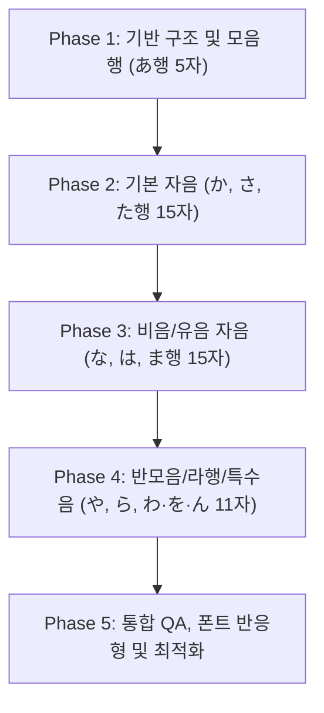

# 히라가나 50음도 연상 기억법(Visual Mnemonic) SVG 전체 구현 계획서

## 1. 개요 및 목적
* **목적**: 히라가나 46자(50음도 기본음)를 암기할 때, 텍스트 해설에 의존하지 않고 **직관적인 미니멀 라인아트 그림과 글자의 결합**을 통해 0.1초 만에 발음과 형태를 각인시키는 시각적 연상 암기 시스템 구축.
* **검증된 성공 모델 (あ - 아기)**:
  * **미니멀 라인아트**: 복잡한 소품 및 배경 배제, 개체의 본질적 형태만 부드러운 단선(`stroke="#78716C"`)으로 표현.
  * **색상 최소화**: 무지개빛 다색 배제, 개체당 1~2개의 은은한 포인트 컬러(예: 볼터치 핑크, 쪽쪽이 옐로우)만 절제 사용.
  * **구도적 조화**: 히라가나 획이 사물의 핵심 특징(얼굴, 디테일)을 가리지 않도록 공간 분할 + 화이트 외곽선(`paintOrder: stroke fill`)으로 100% 가독성 확보.
  * **직관적 단어 강조 라벨**: 로마자(`a`) 및 중복 괄호(`[아]`) 배제, 오직 연상 단어 중 발음 음절에만 테마 포인트 컬러 적용 (<span style="color:#E07A5F; font-weight:bold;">아</span>기).

---

## 2. 50음도 46자 전수 연상 단어 및 시각적 매핑 명세 (Master Data)

| 행 | 글자 | 발음 | 연상 단어 | 강조 위치 | 시각적 특징 및 형태 매핑 (SVG 디자인 가이드) | 포인트 컬러 (1~2개) |
|:---|:---:|:---:|:---|:---:|:---|:---|
| **あ행** | **あ** | 아 | **아**기 | 첫 글자 (0) | 포대기 속 둥근 아기 얼굴, 배냇머리, 앙증맞은 쪽쪽이 실드와 링 | 볼터치(핑크), 쪽쪽이(연노랑) |
| | **い** | 이 | **이**빨 / 입 | 첫 글자 (0) | 활짝 벌린 입술 라인과 그 안에서 나란히 드러난 두 개의 앞니 기둥 | 잇몸/입술(연코랄) |
| | **う** | 우 | **우**산 | 첫 글자 (0) | 상단 우산 꼭지 점과 아래로 둥글게 굽어내려오는 우산 손잡이 라인 | 우산천(파스텔 스카이) |
| | **え** | 에 | **에**어로빅 | 첫 글자 (0) | 머리띠를 두르고 팔다리를 양옆으로 쭉 뻗으며 스텝을 밟는 체조 실루엣 | 헤어밴드(민트) |
| | **お** | 오 | **오**리 | 첫 글자 (0) | 둥근 머리와 활짝 편 날개깃, 통통한 가슴과 둥근 부리 라인 | 부리/발(오렌지) |
| **か행** | **か** | 카 | **카**메라 | 첫 글자 (0) | 카메라 사각 바디와 원형 줌 렌즈, 상단 셔터 버튼 삐침 | 렌즈 반사광(연파랑) |
| | **き** | 키 | **키** (열쇠) | 첫 글자 (0) | 앤틱 황금 열쇠의 2개 톱니 이빨(가로 2획), 기둥 자루(세로 획), 둥근 손잡이 링(하단 곡선) | 열쇠 바디(골드), 반짝임(오렌지) |
| | **く** | 쿠 | **쿠**키 | 첫 글자 (0) | 한 입 '와삭' 베어 문 둥근 초코칩 쿠키의 V자(< 형태) 베어 문 자국 | 쿠키 바디(베이지), 초코칩(다크브라운) |
| | **け** | 케 | **케**이크 | 첫 글자 (0) | 케이크 옆면 기둥과 상단에 꽂힌 촛불 하나의 수직 라인 | 촛불 불꽃(따뜻한 주황) |
| | **こ** | 코 | **코**끼리 | 첫 글자 (0) | 코끼리의 둥근 머리/등선(위 가로선)과 길게 뻗은 코(아래 가로선) | 볼터치(핑크) |
| **さ행** | **さ** | 사 | **사**과 | 첫 글자 (0) | 꼭지와 나뭇잎 하나가 달린 탐스러운 사과의 하단 둥근 곡선 | 사과 잎사귀(연초록) |
| | **し** | 시 | 낚**시** | 끝 글자 (1) | 낚싯줄에서 내려와 둥글게 굽은 낚싯바늘 끝에 펄떡이는 물고기가 걸린 모습 | 낚싯바늘(실버), 물고기(스카이블루), 찌(오렌지) |
| | **す** | 스 | **스**프링 | 첫 글자 (0) | 수직으로 내려오다가 둥글게 회전하며 감기는 용수철 매듭 루프 | 스프링 끝단(연파랑) |
| | **せ** | 세 | **세**면대 | 첫 글자 (0) | 아치형 거울, 세면대 상판과 도자기 볼, 크롬 수전 및 핑크 비누가 놓인 세면대 | 수전(메탈크롬), 물줄기(스카이블루), 비누(핑크) |
| | **そ** | 소 | **소**라 | 첫 글자 (0) | 위에서 아래로 꼬불꼬불 나사처럼 회전하며 층층이 감겨 내려오는 나사고둥(나사산 회전 마디가 'そ'의 지그재그 획 및 하단 곡선과 1:1 일치), 살구빛 진주 입구 | 나사 소라 껍데기(크림/웜골드), 입구/진주(살구/화이트), 불가사리(핑크) |
| **た행** | **た** | 타 | **타**조 | 첫 글자 (0) | 긴 목과 튼튼한 두 다리로 바람을 가르며 질주하는 타조 몸체 | 부리(노랑) |
| | **ち** | 치 | **치**타 | 첫 글자 (0) | 유선형 몸체로 질주하는 치타, 특유의 눈물선, 12개의 선명한 블랙 스팟과 긴 꼬리 | 치타 몸통(골드베이지), 스팟(블랙), 볼/코(핑크) |
| | **つ** | 츠 | 부**츠** | 끝 글자 (1) | 발목 양털 털트림, 골드 버클 스트랩, 둥근 앞코와 도톰한 뒤꿈치 굽의 겨울 부츠 | 부츠(웜옐로우), 굽/밑창(차콜), 버클(골드) |
| | **て** | 테 | **테**이프 | 첫 글자 (0) | 롤 테이프 디스펜서에서 팽팽하게 뽑아져 나온 투명 테이프와 메탈 톱니 커터 날 | 디스펜서/테이프(민트/에메랄드), 커터(실버) |
| | **と** | 토 | **토**끼 | 첫 글자 (0) | 쫑긋한 두 귀, 반짝이는 눈과 복숭아 볼터치, 미니 당근을 쥔 사랑스러운 아기 토끼 | 귀/볼(핑크), 당근(오렌지/초록), 몸체(크림화이트) |
| **나행** | **な** | 나 | **나**비 | 첫 글자 (0) | 더듬이, 왼쪽 날개(1·2획), 오른쪽 앞날개 무늬(3획), 둥근 뒷날개(4획)가 일체화된 우아한 나비 | 날개(파스텔 퍼플), 무늬(마젠타), 꽃(핑크/옐로우) |
| | **に** | 니 | 바구**니** | 끝 글자 (2) | 아치형 손잡이와 라탄 격자 몸체, 탐스러운 사과와 바게트가 담긴 피크닉 바구니 | 사과(레드), 바게트(옐로우), 바구니(라탄골드), 냅킨(레드체크) |
| | **ぬ** | 누 | **누**에 | 첫 글자 (0) | 뽕잎 위에서 몸통을 둥글게 말아 올린 아기 누에와 꼬리 매듭의 황금 누에고치 | 고치/실(골드옐로우), 뽕잎(그린), 몸체(크림화이트) |
| | **ね** | 네 | 그**네** | 끝 글자 (1) | A자형 놀이터 프레임, 두 가닥 굵은 트위스트 밧줄(1·2획)과 원목 널빤지, 우하단 둥근 밧줄 매듭 루프 | 그네 프레임(민트), 밧줄(엠버골드), 널빤지(우드) |
| | **の** | 노 | **노**래 | 첫 글자 (0) | 헤드폰을 끼고 두 눈을 감은 채 동그랗게 입을 모아 '노~♪' 노래하는 사랑스러운 얼굴(외곽 윤곽선 & 안쪽 O자 입 모양이 글자 の와 1:1 완벽 일치), 입가에서 피어오르는 음표와 하트 | 헤드폰(스카이블루), 피부(스킨톤), 입술(코랄레드), 음표/하트(핑크/퍼플), 별빛(골드) |
| **は행** | **は** | 하 | **하**마 | 첫 글자 (0) | 듬직한 몸통과 굵은 앞다리(1획), 어깨에 바로 안착한 머리와 쩌억 벌린 윗턱(2획), 둥근 아랫턱과 혀·엄니(3획 루프) | 입속/혀(코랄핑크), 몸체(라벤더그레이), 물살(스카이블루), 하마새(옐로우) |
| | **ひ** | 히 | **히**죽 | 첫 글자 (0) | 온화하고 부드러운 아치형 눈썹과 해맑은 선한 반달 눈웃음, 포근한 볼터치, 글자 ひ 자체가 활짝 웃는 U자 입모양 및 우측 미소선과 일체화, 따뜻한 황금 반짝이 | 얼굴(크림), 볼/입(피치핑크), 머리/눈썹(브라운), 반짝이(골드) |
| | **ふ** | 후 | **후**라이팬 | 첫 글자 (0) | 차콜 무쇠 팬 바디, 원목 손잡이(3획), 지글지글 계란 프라이(2·4획), 모락모락 '후~' 김(1획) | 계란 노른자(골드옐로우), 흰자(화이트/골든크러스트), 손잡이(우드), 팬(차콜) |
| | **へ** | 헤 | **헤**엄 | 첫 글자 (0) | 파란 수영복과 발차기 물보라, 시원하게 물살을 가르며 하이 엘보로 치솟은 팔(산 모양 ^), 수영모·수경을 쓰고 숨 내쉬는 자연스럽고 귀여운 수영선수 | 수영복(로열블루), 수영모(마린블루), 물안경(스카이블루), 피부(스킨톤), 물살(블루/화이트) |
| | **ほ** | 호 | **호**랑이 | 첫 글자 (0) | 땅을 딛는 굵은 앞다리(1획), 이마의 王자·눈썹(2획), 뺨의 호피 줄무늬·수염(3획), 머리 위 쫑긋 솟은 귀(4획 상단 삐침), '어흥~' 포효하는 입·엄니(4획 루프), 살랑이는 줄무늬 꼬리 | 털/몸체(골든오렌지), 줄무늬(차콜블랙), 입/코(크림슨/핑크), 눈(앰버골드), 대나무(그린) |
| **ま행** | **ま** | 마 | **마**술 | 첫 글자 (0) | 대형 실크햇 & 꽂힌 트럼프 카드 2장(3획 상단), 와이드 모자 챙·레드 리본·골드 버클(1획), 흰 장갑 손이 쥔 롱 마술봉 & 끝에서 터지는 마법 연기 구름과 대형 황금 별(2획), 글자 루프를 양 앞발로 쥐고 뿅 튀어나온 큼직한 마술 토끼(3획 루프), 펄럭이는 레드 안감 마술 망토(3획 뻗침) | 실크햇/망토(블랙/레드), 카드(화이트/레드/블랙), 장갑/토끼(화이트/핑크), 마법별(골드), 스테이지(바이올렛) |
| | **み** | 미 | **미**로 | 첫 글자 (0) | 입체 미로 보드와 벽면, START 초록 깃발에서 루프를 돌아 출구로 빠져나오는 성공 탈출 경로(1획), FINISH 출구 메탈 깃대와 펄럭이는 레드 깃발(2획) | 미로보드(라벤더), 탈출경로(퍼플네온), 깃발(레드/그린), 별빛(골드) |
| | **む** | 무 | **무**용 | 첫 글자 (0) | 올림머리·티아라와 우아하게 펼친 양팔(1·2획 상단), 풍성한 3단 레이스 핑크 튀튀(허리), 무릎 굽힌 앞다리 토슈즈(2획 루프), 공중으로 솟구친 그랑 주테 뒷다리(2획 꼬리), 흩날리는 토슈즈 실크 리본과 벚꽃 꽃잎·음표(3획 점) | 튀튀/토슈즈(핑크), 티아라/음표(골드), 타이즈(화이트), 꽃잎(로즈) |
| | **め** | 메 | **메**기 | 첫 글자 (0) | 동글넓적한 머리, 좌우로 낭창낭창 뻗은 4가닥 메기 수염, 활짝 웃는 넙적한 입과 황금빛 꼬리지느러미 | 황금빛 꼬리·등지느러미 & 강 수초 |
| | **も** | 모 | **모**기 | 첫 글자 (0) | 콕 찌르는 침·통통한 줄무늬 배(1획)와 윙윙 날갯짓하는 두 쌍의 투명 날개(2·3획) | 날개(스카이블루), 볼터치/배끝(핑크/코랄) |
| **や행** | **や** | 야 | **야**구 | 첫 글자 (0) | 배트를 힘차게 휘두르는 타자의 팔 각도와 날아오는 야구공(작은 점) | 야구공 실밥(레드) |
| | **ゆ** | 유 | **유**도 | 첫 글자 (0) | 유도 도복 깃을 맞잡고 상대를 공중으로 번쩍 들어 메치는 둥근 회전축 | 도복 띠(블랙) |
| | **よ** | 요 | **요**트 | 첫 글자 (0) | 팽팽하게 바람을 머금은 요트의 삼각 돛과 둥근 선체 라인 | 돛 깃발(오렌지) |
| **ら행** | **ら** | 라 | **라**켓 | 첫 글자 (0) | 공중에 튄 형광 테니스공(상단 1획 점)과 라켓 손잡이 및 둥근 타원형 헤드 거트망(2획 둥근 곡선) | 테니스공(라임옐로우), 라켓 프레임(로열블루) |
| | **り** | 리 | **리**본 | 첫 글자 (0) | 선물 상자 뚜껑 위 풍성한 핑크 실크 나비 매듭(상단), 1획의 짧은 갈고리 꼬리(V자 피쉬테일 컷)와 2획의 유려한 롱 곡선 꼬리(V자 피쉬테일 컷), 골드 펄 십자 띠와 하트 태그 | 실크 리본(로즈핑크), 선물 상자/골드 띠(크림/골드옐로우) |
| | **る** | 루 | 캥거**루** | 끝 글자 (2) | 서 있는 캥거루의 등뼈와 배주머니 속에 쏙 들어간 아기의 둥근 루프 | 배주머니 속 아기(베이지) |
| | **れ** | 레 | 애벌**레** | 끝 글자 (2) | 나뭇잎 위를 꿈틀꿈틀 기어가는 연두색 애벌레의 마디마디 굴곡선 | 애벌레 볼(연홍색) |
| | **ろ** | 로 | **롤**러스케이트 | 첫 글자 (0) | 바퀴 2개가 달린 롤러스케이트 차체 프레임 (루프 없는 깔끔한 꺾임) | 바퀴 휠(스카이블루) |
| **わ·ん** | **わ** | 와 | **와**~ | 첫 글자 (0) | 감탄하며 입을 크게 벌리고 "와~" 소리 내는 아이의 둥근 볼선 | 벌린 입속(연핑크) |
| | **を** | 오 | **오**징어 | 첫 글자 (0) | 세모난 머리 지느러미와 아래로 굽이치며 뻗은 다리들의 유려한 곡선 | 오징어 눈(차콜 점) |
| | **ん** | 응 | **응**가 | 첫 글자 (0) | 양변기에 앉아 배에 힘을 주며 웅크린 아이의 허리와 다리 굴곡 각도 | 변기 레버(메탈릭) |

---

## 3. 소프트웨어 아키텍처 및 모듈화 설계

### 3.1 파일 디렉토리 구조
기존 단일 컴포넌트(`HiraganaMnemonicSvg.tsx`)에 46개를 모두 몰아넣으면 유지보수가 불가능하므로, 행(Row) 단위 서브 컴포넌트로 분리하고 메인 레지스트리가 조합하는 구조를 채택합니다.

```text
src/components/hiragana/
├── HiraganaFlashcards.tsx              # 플래시카드 메인 (기존)
├── HiraganaMnemonicSvg.tsx             # 메인 디스패처 및 공통 레이아웃/라벨
└── mnemonics/                          # 행별 SVG 드로잉 컴포넌트
    ├── MnemonicRowA.tsx                # あ, い, う, え, お
    ├── MnemonicRowKa.tsx               # か, き, く, け, こ
    ├── MnemonicRowSa.tsx               # さ, し, す, せ, そ
    ├── MnemonicRowTa.tsx               # た, ち, つ, て, と
    ├── MnemonicRowNa.tsx               # な, に, ぬ, ね, の
    ├── MnemonicRowHa.tsx               # は, ひ, ふ, へ, ほ
    ├── MnemonicRowMa.tsx               # ま, み, む, め, も
    ├── MnemonicRowYa.tsx               # や, ゆ, よ
    ├── MnemonicRowRa.tsx               # ら, り, る, れ, ろ
    ├── MnemonicRowWa.tsx               # わ, を, ん
    └── types.ts                        # SVG 공통 Props 및 타입 정의
```

### 3.2 데이터 스키마 정의 (`types.ts`)
```typescript
export interface MnemonicItem {
  char: string;          // 예: 'あ', 'つ', 'る'
  word: string;          // 예: '아기', '부츠', '캥거루'
  highlightIndex: number; // 강조할 음절 인덱스 (0: 첫글자, 1: 두번째 등)
}

export interface MnemonicSvgChildProps {
  char: string;
  fontFamily: string;
}
```

### 3.3 공통 SVG 렌더링 규격 (Design System Tokens)
* **ViewBox**: `viewBox="0 0 200 160"` (표준화)
* **라인 스타일**: `stroke="#78716C"` (웜차콜), `strokeWidth="1.8"`, `strokeLinecap="round"`, `strokeLinejoin="round"`
* **포인트 색상 규격**: 단일 개체당 1~2개 이내, 은은한 파스텔 채도 유지
* **글자 오버레이 규격**:
  ```tsx
  <text
    x="110"
    y="120"
    textAnchor="middle"
    fill="#1C1917"
    fontSize="114"
    fontWeight="bold"
    style={{
      fontFamily,
      paintOrder: 'stroke fill',
      stroke: '#FFFFFF',
      strokeWidth: '6px',
      strokeLinejoin: 'round'
    }}
  >
    {char}
  </text>
  ```
* **하단 라벨 규격**:
  ```tsx
  <div className="mt-2.5 flex items-center justify-center">
    <span className="text-base font-bold tracking-wider">
      {item.word.split('').map((letter, idx) => (
        <span
          key={idx}
          className={
            idx === item.highlightIndex
              ? 'text-[#E07A5F] font-black text-lg'
              : 'text-stone-500 font-semibold'
          }
        >
          {letter}
        </span>
      ))}
    </span>
  </div>
  ```

---

## 4. 단계별 구현 로드맵 (5단계 스프린트)



### Phase 1: 아키텍처 정립 및 あ행(모음 5자) 완성
* **목표**: `types.ts` 생성, 데이터 명세표 분리, `MnemonicRowA.tsx` (あ, い, う, え, お) 완성
* **검증 포인트**:
  * `あ`(아기) 기존 완성본 리팩토링 및 완벽 이식
  * `い`(이빨), `う`(우산), `え`(에어로빅), `お`(오리)의 미니멀 라인아트 품질 및 글자 가독성 검증

### Phase 2: 기본 자음 15자 (か · さ · た 행)
* **목표**:
  * `か행` (카메라, 기타, 쿠션, 케이크, 코끼리)
  * `さ행` (사과, 시계, 스프링, 세수, 소라)
  * `た행` (타조, 치타, 부츠, 테이프, 토끼)
* **핵심 체크**: `さ`(사과)와 `ち`(치타)의 반대 곡선 방향이 명확히 대비되는지 시각적 확인

### Phase 3: 중간 자음 15자 (な · は · ま 행)
* **목표**:
  * `な행` (나비, 바구니, 누에, 그네, 노래)
  * `は행` (하마, 히죽, 후라이팬, 헤엄, 호랑이)
  * `ま행` (마술, 미로, 무용, 메기, 모기)
* **핵심 체크**:
  * `ぬ`(누에: 꼬리 매듭 있음) vs `め`(메기: 꼬리 매듭 없음) 형태 구별력 극대화
  * `は`(하마) vs `ほ`(호랑이: 상단 삐침 있음) 머리 획 차이 시각화

### Phase 4: 반모음 · 라행 · 특수음 11자 (や · ら · わ 행 및 ん)
* **목표**:
  * `や행` (야구, 유도, 요트)
  * `ら행` (라켓, 리본, 캥거루, 애벌레, 롤러스케이트)
  * `わ행` 및 특수음 (와~, 오징어, 응가)
* **핵심 체크**:
  * `る`(캥거루: 배주머니 아기 고리 있음) vs `ろ`(롤러스케이트: 고리 없음) 확실한 시각 차이 구현
  * `ん`(응가: 변기 곡선)의 직관적 발음 연동

### Phase 5: 최종 검증 및 성능 최적화
* **빌드 및 렌더링 테스트**:
  * SVG path 번들 크기 경량화 및 불필요한 DOM 요소 제거
  * 고딕(`sans`) / 명조(`serif`) 폰트 전환 시 글자 위치 정렬 점검
  * 모바일 화면(작은 화면폭) 및 다크 모드/라이트 모드 대비 검증
  * `npx tsc --noEmit` 전체 컴파일 무결성 검증

---

## 5. 기대 효과
1. **학습 속도 3배 향상**: 활자만 보고 외울 때보다 한국어 단어 시각 연상을 통해 왕초보도 50음도를 1~2일 내에 완벽 각인.
2. **헷갈리는 글자 완벽 정복**: 모양이 비슷한 대표 혼동 글자쌍(`さ-ち`, `ぬ-め`, `る-ろ`, `は-ほ`)을 그림의 명확한 차이점으로 즉시 구별.
3. **일관되고 세련된 모던 UI**: 미니멀 라인아트와 절제된 1포인트 컬러 규칙으로 부산 다요리 앱의 프리미엄 감성 완성.
